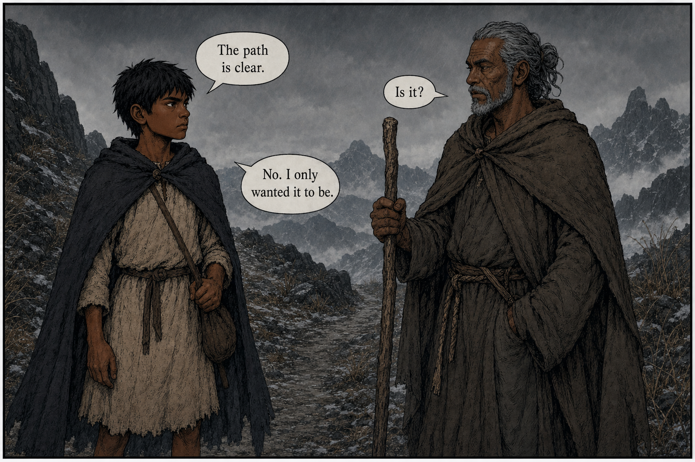
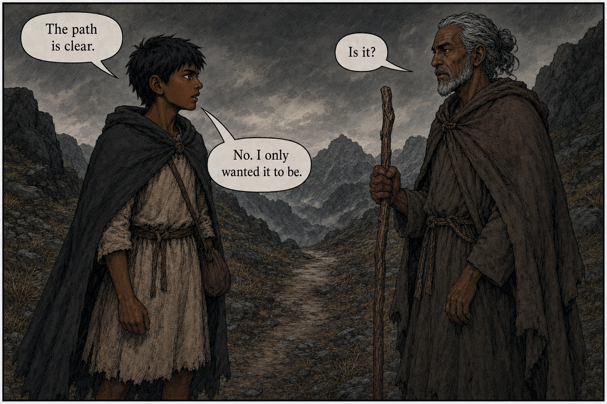
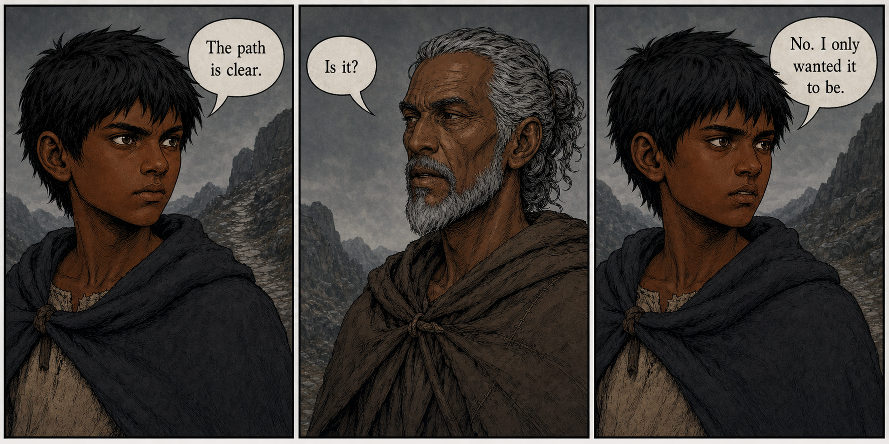
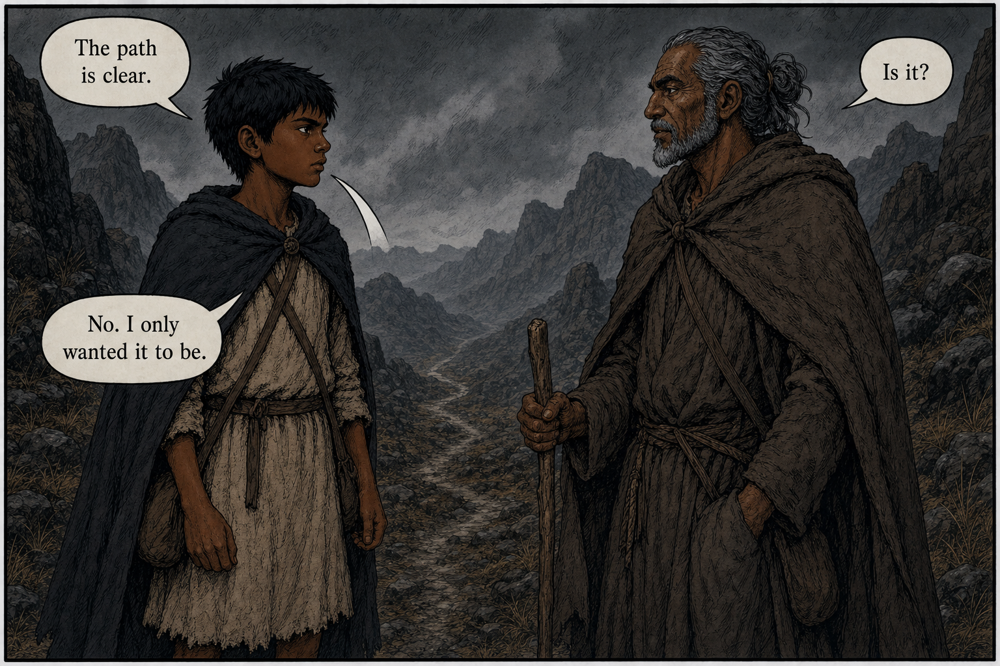

# GPT Image 2 Speech-Bubble Attribution Study

Date: 2026-07-09

## Purpose

Pages 2 and 11 showed that accurate lettering is not enough: a page still fails when a reader cannot identify the speaker without consulting the script. This study tests prompt patterns for a three-line A-B-A exchange and turns the results into production rules.

All four tests used the built-in Codex image-generation path with native multi-reference inputs: Duny, Ogion, and an approved Earthsea page for the visual register. No API key, Image API call, or separately billed API workflow was used.

## Official Guidance Reviewed

OpenAI's [GPT Image Generation Models Prompting Guide](https://developers.openai.com/cookbook/examples/multimodal/image-gen-models-prompting-guide) does not provide a speech-balloon-specific recipe. Its relevant general guidance is:

- Use a consistent, skimmable prompt structure.
- Specify composition and placement when layout matters.
- Quote literal text and state typography and placement constraints.
- Label each reference image by index and role.
- Separate what may change from what must remain invariant.
- Start from a clean prompt and make small, controlled iterations.

The attribution rules below are therefore project findings derived from those principles and the tests, not claims copied from an official balloon guide.

## Controlled Exchange

Every test used the same dialogue:

1. Duny: `The path is clear.`
2. Ogion: `Is it?`
3. Duny: `No. I only wanted it to be.`

## Results

### Test 1 - Loose single-panel baseline



- Prompt pattern: Duny left, Ogion right, followed by a speaker-labelled dialogue list.
- Output: 1536x1024.
- Result: all text and speaker assignments were correct.
- Weakness: Duny's final tail stopped in his vicinity instead of clearly terminating at his mouth. The composition rescued the attribution, but the tail did not meet production standard.

### Test 2 - Explicit balloon geometry



- Prompt pattern: numbered balloons; exact upper-left, upper-right, and lower-left positions; speaker location; exact balloon count per speaker; short tail endpoint; no crossing or connection.
- Output: 1536x1024.
- Result: exact text, correct A-B-A order, and unambiguous speaker assignment. This was the strongest single-panel result.
- Weakness: tail endpoints were directionally correct but still interpreted somewhat loosely rather than literally touching each mouth.

### Test 3 - One speaker per panel



- Prompt pattern: three sequential panels, one visible speaker and one balloon in each panel.
- Output: 1774x887, despite a requested 3:2 canvas.
- Result: attribution was effectively impossible to misread, and all text was exact.
- Weakness: it spends more panels on the exchange and the model ignored the requested canvas ratio. Canvas dimensions therefore remain a separate mandatory QA gate.

### Test 4 - Exact explicit-geometry repeat



- Prompt pattern: the same geometry and attribution instructions as Test 2.
- Output: 1536x1024.
- Result: text and speaker assignment remained correct.
- Weakness: one tail ended at Duny's torso rather than his mouth, and the image introduced an orphan white tail-like fragment. Identical strong instructions reduced risk but did not make geometry deterministic.

## Production Conclusions

1. Treat attribution as scene blocking, not as a lettering repair. The page should remain readable even if a tail stops slightly short.
2. Put speakers in dialogue order. For A-B, stage A left and B right whenever the panel permits.
3. For A-B-A in one panel, use two vertical tiers: A upper-left, B upper-right, A lower-left. Do not put all three balloons on one horizontal line.
4. Map every balloon separately: ordinal, speaker, verbatim line, balloon position, speaker body position, and tail endpoint.
5. State exact balloon counts per speaker and identify silent characters explicitly.
6. Keep mouths visible and reserve a clean tail corridor. Hands, staffs, animals, and third characters must not sit between balloon and speaker.
7. Use short tails. Long or crossing tails create ambiguity even when they technically point in the right direction.
8. For a high-risk exchange, use one speaker per panel. This is the most reliable fallback, but validate the resulting canvas dimensions.
9. Inspect every finished page at full resolution for text, order, tail endpoint, orphan tail fragments, and silent-character violations. Prompt language alone is not a guarantee.
10. If attribution fails, regenerate the full page with revised blocking. Do not crop-patch tails or swap text between existing balloons.

## Canonical Prompt Block

Use this inside a full page prompt after the scene and character references are established:

```text
Dialogue staging:
- CHARACTER A stands on the LEFT; CHARACTER B stands on the RIGHT.
- Both faces and mouths are visible. Keep a clear empty corridor between each balloon and its speaker.

Balloon map:
1. UPPER LEFT: CHARACTER A says verbatim: "..."
   One off-white balloon beside CHARACTER A. One short triangular tail ending at CHARACTER A's mouth.
2. UPPER RIGHT: CHARACTER B says verbatim: "..."
   One off-white balloon beside CHARACTER B. One short triangular tail ending at CHARACTER B's mouth.
3. LOWER LEFT, below both upper balloons: CHARACTER A says verbatim: "..."
   One off-white balloon beside CHARACTER A. One short triangular tail ending at CHARACTER A's mouth.

Reading order is 1, 2, 3. Do not cross or connect tails.
CHARACTER A has exactly two balloons. CHARACTER B has exactly one balloon.
All other characters are silent and have no balloons.
No tail may point toward the wrong speaker, a hand, a prop, an animal, or empty space.
Render every supplied line exactly once. No extra text or blank balloons.
```

## QA Checklist

- Read the page without the script. Is every speaker immediately obvious?
- Does visual reading order match dialogue order?
- Does every tail point to the correct face, not merely the correct half of the panel?
- Are all mouths visible?
- Are there any orphan white marks that resemble tails or bubbles?
- Does each speaker have exactly the scripted number of balloons?
- Are silent characters actually silent?
- Is the output still 1536x1024?
