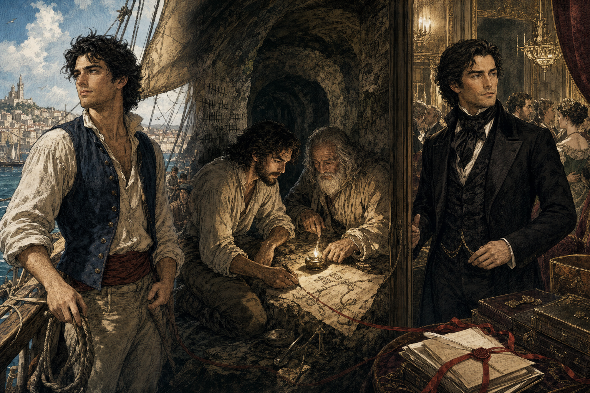
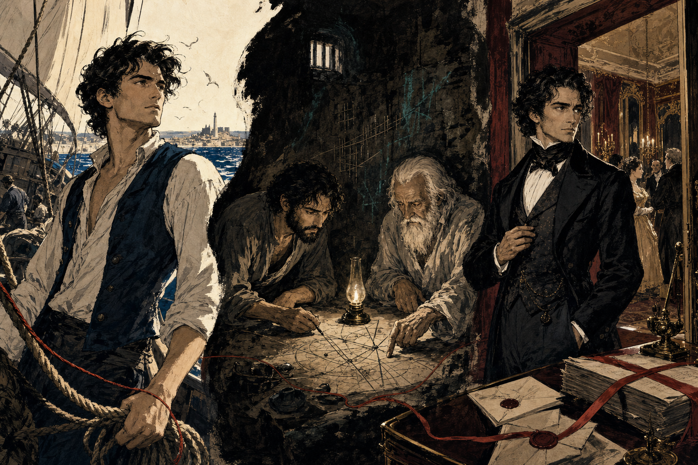
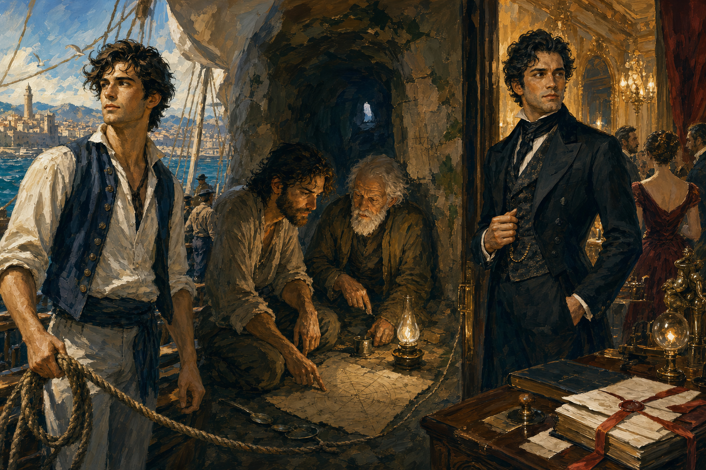

# The Count of Monte Cristo — Graphic-Style Exploration

## Status

**Velvet Cinema selected by Andres on 2026-07-24.**

The selected image establishes the graphic direction, not approved character,
costume, architecture, ship, prison, or object references. Those must still be
developed and locked before production pages.

The project-level story rules are locked in
[`../CREATIVE-MANDATE.md`](../CREATIVE-MANDATE.md). Velvet Cinema must serve a
dialogue-driven adventure, not turn historical detail into the foreground or
make pages read like an illustrated treatise.

All three tests use the same continuous-narrative spread so that the comparison
is about graphic language rather than subject matter:

- young Edmond aboard the *Pharaon* in sunlit Marseille, 1815;
- Edmond and Faria learning together inside Château d'If;
- the transformed Count entering a Paris salon in 1838;
- a rope, diagram line, and red sealing ribbon linking the three worlds;
- no lettering.

**Locked production canvas: 1536 × 1024, 3:2 landscape.** Portrait and square
story pages are out of scope.

## Option 1 — Romantic Engraving



A contemporary graphic-novel synthesis of 1840s steel engraving,
lithographic illustration, cinematic blocking, and restrained hand-applied
color.

### Strengths

- Feels born from the same nineteenth-century print world as Dumas's serial.
- Makes letters, documents, disguises, rooms, and hidden mechanisms visually
  important rather than incidental.
- The engraved texture unifies Marseille, prison stone, and Parisian luxury
  while the color system keeps those worlds distinct.
- Edmond remains unusually recognizable across all three identities.

### Risks

- Dense cross-hatching can compete with native captions and speech balloons.
- Small panels could become visually overworked unless detail is aggressively
  concentrated at focal points.
- A full volume needs quiet pages and open light so the texture does not become
  monotonous.

## Option 2 — Abyssal Ink



Broad calligraphic black shapes, carved negative space, dry brush, rough ivory
paper, and a severely restricted palette of marine blue, oxblood, copper green,
and old gold.

### Strengths

- The strongest and most immediate shelf identity.
- Can make Château d'If, the burial sack, the sea, and the moral abyss of revenge
  structural forces in the composition.
- Large areas of negative space are naturally friendly to native lettering.
- The red line can recur as letter, wound, seal, account, and thread of
  consequence.

### Risks

- Parisian costume, social rank, and domestic splendor may lose information.
- A long prison movement could become oppressively black if every page uses the
  maximum contrast.
- Faces and recurring objects will require especially rigorous reference locks.

## Option 3 — Velvet Cinema



Layered matte gouache and opaque watercolor, broad visible brushwork, sparse
charcoal construction, sculpted light, and selective crisp detail at faces and
hands.

### Strengths

- The most immediately immersive and emotionally accessible option.
- Excellent range from Mediterranean daylight to intimate prison lamplight to
  Parisian spectacle.
- Readable faces, costumes, architecture, and physical action make it the safest
  base for a very large cast.
- Cinematic blocking should support dialogue-heavy pages and ensemble scenes.

### Risks

- Least distinctive unless broad brush shapes and matte surfaces remain locked.
- The generator can drift toward glossy game concept art or generic prestige
  historical realism.
- It does not make the novel's origin in print and documents as visible as
  Romantic Engraving does.

## Selected Direction — Velvet Cinema

Use **Velvet Cinema** as the production base.

Its combination of readable faces, tactile historical environments, controlled
palette shifts, and cinematic blocking gives the story enough range for
Marseille, Château d'If, Monte Cristo, Rome, and Paris while supporting its very
large recurring cast.

Production guardrails:

1. preserve broad matte-gouache brushwork, sparse charcoal construction, and
   simplified shadow masses;
2. avoid glossy surfaces, airbrushed faces, photographic lens effects, and
   generic game-concept-art polish;
3. keep detail selective so native lettering has deliberately composed space;
4. make every story-world visually distinct through light and palette without
   changing the underlying medium;
5. use documents, seals, ropes, diagrams, and recurring objects as compositional
   lines so the machinery of cause and consequence remains visible;
6. borrow Abyssal Ink's large negative spaces when prison or vengeance closes
   around Edmond, without turning the project into a hybrid style.

## Next Style Gate

After a direction is selected and the first Edmond/Faria references are locked,
prototype three different burdens:

1. **The examination:** Edmond, Villefort, the letter, political stakes, and
   dense native dialogue.
2. **The tunnel and school:** spatial clarity, improvised tools, time passing,
   intellectual excitement, and warm/cold contrast.
3. **A Paris dinner:** six or more recurring faces, native lettering, costume
   hierarchy, concealed histories, and social action staged like warfare.

Do not begin production pages before the character and object references needed
by each prototype have been approved.

## Generation Record

Generated with the built-in Codex image-generation tool under the user's
subscription entitlement. No API key or separately billed CLI path was used.

### Shared Content

```text
Use case: historical-scene
Asset type: visual-development graphic-style demo for a serious, richly readable graphic-novel adaptation of Alexandre Dumas's The Count of Monte Cristo; exact canvas 3:2 landscape
Primary request: Create one finished continuous-narrative spread of "the three lives of Edmond," with NO visible title or lettering. The same man must be recognizably present at three ages and states. LEFT: Marseille, February 1815, brilliant Mediterranean morning; nineteen-year-old Edmond Dantès stands on the working deck of the merchant ship Pharaon as it enters harbor, competent, warm, windblown dark curls, lean sailor's build, simple off-white shirt and dark blue waistcoat, sailcloth and rigging, open horizon, salt-white light. CENTER: deep inside Château d'If years later; gaunt bearded Edmond and elderly Abbé Faria kneel in a cramped hand-dug passage lit by one improvised oil lamp, studying a handmade diagram and improvised tools; stone, damp, calendar scratches, intellectual warmth inside physical cold. RIGHT: Paris, 1838; the transformed Count of Monte Cristo, late thirties, unmistakably the same eyes and bone structure, pale, controlled, elegant black hair and immaculate black evening clothes, stands in the doorway of a gaslit aristocratic salon; mirrors, velvet, sealed letters, ledgers, and turning guests make the room feel like a trap he already controls. A subtle visual line links the zones: ship rope becomes prison scratches and diagram lines, then becomes a red sealing ribbon across the Paris documents.
Composition/framing: panoramic 3:2 landscape, three linked environmental zones with flowing transitions rather than a rigid equal panel grid or collage. Preserve Edmond's identity through matching eye shape, brow, nose, cheekbones, and a repeated poised right-hand gesture.
Constraints: historically plausible Marseille in 1815 and Paris in 1838; serious all-ages graphic novel for sophisticated readers ages 7 and 10 without childish simplification; no lettering, no title, no speech balloons, no caption boxes, no watermark.
Avoid: generic steampunk, superhero costume, fantasy aristocrat, pirate clichés, photorealism, glossy game concept art, modern anime, chibi, children's-book cuteness, exaggerated grimdark, ornamental faux-French text, random symbols.
```

### Prompt 1 — Romantic Engraving

```text
Style/medium: "Romantic Engraving" — a contemporary mature graphic-novel synthesis of 1840s steel engraving, lithographic illustration, and cinematic sequential art. Precise expressive pen contours, disciplined cross-hatching and stipple, engraved shadow architecture, tactile cream paper, then transparent hand-applied color washes. Faces must be emotionally specific and anatomically credible; figures must feel alive rather than posed. Original synthesis, not a copy of any single illustrator.
Composition additions: Clear foreground, middle ground, and depth; Edmond's repeated gaze guides the eye left to right. Strong readable silhouettes and calm tonal areas that could later carry captions, but draw no boxes.
Lighting/mood: joy and possibility becoming endurance and discovery, then magnificence edged with danger. Epic, intelligent, mysterious, and human.
Color palette: Marseille salt white, working blue, warm ochre and sunlit skin; prison rust, damp green-black, stone gray and one amber lamp; Paris polished black, burgundy, emerald, old gold and ivory. The red sealing ribbon is the one strong recurring accent.
Materials/textures: etched line, cross-hatched ink, fibrous paper, transparent gouache wash, sailcloth, rope, wet stone, worn linen, velvet, polished wood, wax seals, mirror glass.
Avoid additions: monochrome-only antique illustration, static museum tableaux.
```

### Prompt 2 — Abyssal Ink

```text
Style/medium: "Abyssal Ink" — bold contemporary graphic-novel art made from large calligraphic black-ink masses, dry-brush energy, carved white negative space, and opaque flat gouache. Almost no cross-hatching and no soft digital gradients. Forms are built from decisive shapes: the black prison wall can swallow half the page, Marseille sunlight can cut like white paper, and the Count's silhouette can feel like a blade. Faces remain expressive, individual, anatomically credible, and easy to recognize despite the abstraction. Sophisticated printmaking force with hand-painted irregularity, an original synthesis rather than a copy of any artist.
Composition additions: Use dynamic diagonals, dramatic scale changes, strong silhouettes, and deep negative space; repeated eye line guides left to right. Leave a few calm areas that could later hold captions, but draw no boxes.
Lighting/mood: exuberant sea light collapsing into the prison abyss, then re-forming as controlled Parisian darkness. Urgent, dangerous, mythic, intelligent, emotionally direct.
Color palette: warm ivory paper and carbon black dominate; marine ultramarine for Marseille and the sea; oxidized copper green only in prison damp; oxblood red for the linking ribbon and Paris; small flashes of old gold for the lamp and salon. No broad naturalistic full color.
Materials/textures: pooled ink, dry brush, scraper marks, matte gouache, rough cotton paper, rope, wet stone, worn linen, velvet, wax seals.
Avoid additions: fine antique engraving, dense cross-hatching, delicate watercolor, rainbow palette, manga screentones.
```

### Prompt 3 — Velvet Cinema

```text
Style/medium: "Velvet Cinema" — mature cinematic historical graphic-novel realism painted in layered matte gouache and opaque watercolor over sparse, confident charcoal and ink drawing. Luminous but tactile color, expressive individual faces, credible anatomy, sculpted light, bold simplified shadow shapes, and selective detail only at narrative focal points. Brush edges remain visible; materials feel touchable. It is richly illustrated rather than photographic, and boldly graphic rather than glossy. Original synthesis, not a copy of any artist.
Composition additions: Strong depth, varied scale, elegant character blocking, and a repeated gaze carrying left to right. Create clear focal hierarchy and a few quiet tonal spaces that could later hold native captions, but draw no boxes.
Lighting/mood: Mediterranean radiance, intimate amber learning inside cold darkness, then luxurious gaslight with a current of menace. Romantic, sumptuous, suspenseful, human; beauty and danger coexist.
Color palette: full but disciplined cinematic color: Marseille salt white, cobalt sea, sun-warmed ochre and natural skin; prison mineral gray, damp moss, rust, one amber flame; Paris velvet burgundy, bottle green, lacquer black, ivory, antique gold. The red sealing ribbon is a recurring accent.
Materials/textures: matte gouache, visible brush grain, sailcloth, weathered rope, limestone, damp mortar, rough linen, black wool, silk velvet, polished walnut, wax seals, mirror glass.
Avoid additions: antique engraving, fine cross-hatching, scratchy ink dominance, airbrushed skin, cinematic lens flares.
```

The first Velvet Cinema generation retained too much engraved texture. A
targeted built-in edit preserved the content and composition while removing
cross-hatching and simplifying the image into broad matte-gouache shapes. The
edited result is the saved option above.
